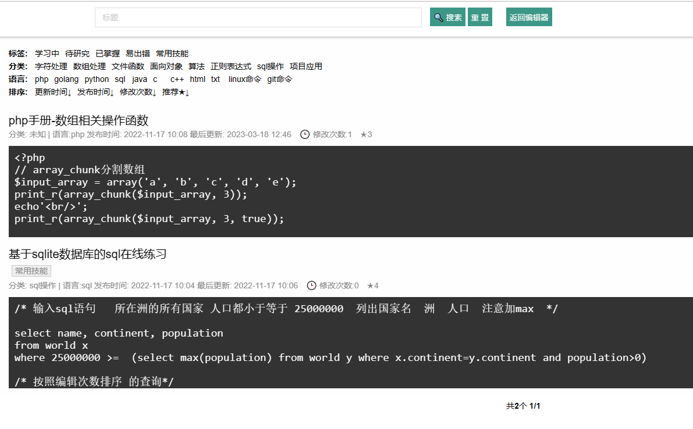

# phpnotebook程序笔记系统

#### 介绍
一个给新手学习编程的笔记工具，适合程序员使用的代码笔记，可以在线运行程序，在线运行sql语句，保存为自己的笔记 方便下次检索。
基于php的程序笔记系统 适合学习程序的工具，在线运行调试程序，方便记录自己的学习笔记，初学者新手学习编程的工具，了解自己的学习过程。

#### 软件架构
软件架构说明 使用 ace-editor markdown sqlite数据库

#### 安装教程

无需配置数据库 可运行php即可

#### 使用说明

1.  运行php  python  C/C++ SQL
2.  每个笔记可以增加自己的说明 markdown编辑器
3.  记录每次的修改，统计每天的新增和修改

#### 参与贡献

1.  Fork 本仓库
2.  新建 Feat_xxx 分支
3.  提交代码
4.  新建 Pull Request

#### 特技

1.  使用 Readme\_XXX.md 来支持不同的语言，例如 Readme\_en.md, Readme\_zh.md
2.  Gitee 官方博客 [blog.gitee.com](https://blog.gitee.com)
3.  你可以 [https://gitee.com/explore](https://gitee.com/explore) 这个地址来了解 Gitee 上的优秀开源项目
4.  [GVP](https://gitee.com/gvp) 全称是 Gitee 最有价值开源项目，是综合评定出的优秀开源项目
5.  Gitee 官方提供的使用手册 [https://gitee.com/help](https://gitee.com/help)
6.  Gitee 封面人物是一档用来展示 Gitee 会员风采的栏目 [https://gitee.com/gitee-stars/](https://gitee.com/gitee-stars/)
